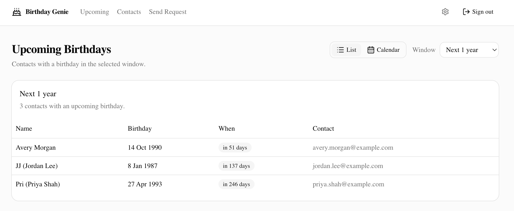
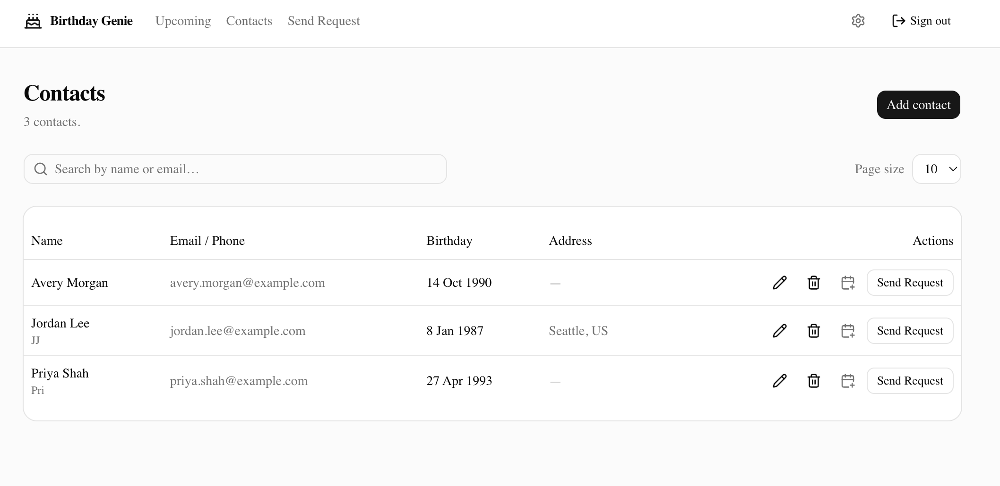
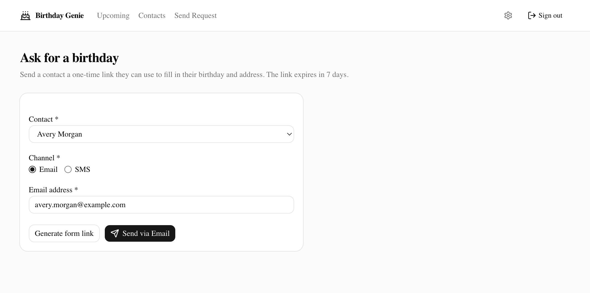
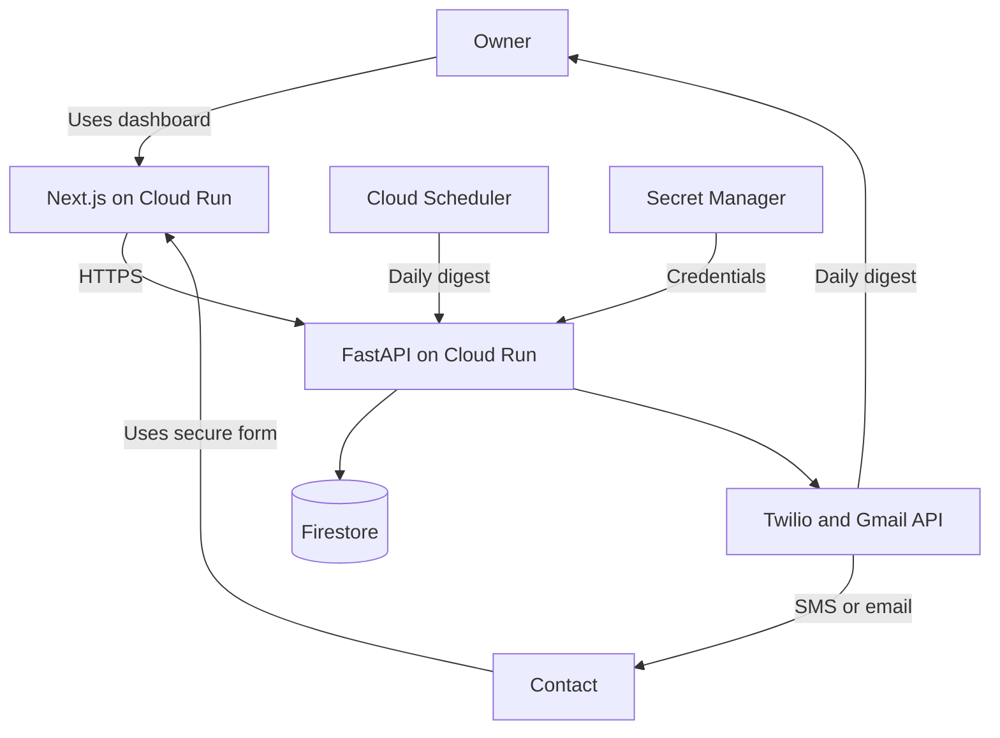

# Birthday Tracker

A cloud-native birthday and contact-management application that automates collecting and maintaining personal contact information. It sends self-service form links through SMS or email, validates submissions through a FastAPI service, stores records in Firestore, and surfaces them through a Next.js dashboard.

## Engineering Highlights

* FastAPI backend with Pydantic validation and documented OpenAPI endpoints
* Next.js and TypeScript dashboard with a self-service data-collection flow
* Firestore persistence with emulator-backed local development and testing
* Twilio and Gmail API integrations for outbound collection requests
* Automated backend and end-to-end testing with Pytest and Playwright
* GitHub Actions CI/CD for Cloud Run, with secrets managed through Google Secret Manager

## Application Preview

### Upcoming Birthdays



### Contacts Management



### Collection Requests



## Stack

| Layer | Tech |
|---|---|
| Backend | Python 3.12 (pyenv) · FastAPI · Pydantic v2 · uv |
| Frontend | Next.js · TypeScript · Tailwind · shadcn/ui |
| Database | Google Firestore |
| Notifications | Twilio (SMS) · Gmail API (email) |
| Hosting | Google Cloud Run |
| Secrets | Google Secret Manager |
| Scheduling | Google Cloud Scheduler |
| CI/CD | GitHub Actions |
| Tests | pytest · pytest-asyncio · httpx · Firestore emulator · Playwright |
| Lint/Types | ruff · mypy · pre-commit |
| Docs | Sphinx (Python) · OpenAPI (FastAPI) · TypeDoc (frontend) |

See [PROJECT_PLAN.md](PROJECT_PLAN.md) for the full plan and rationale.

## Architecture



- The Next.js application provides the owner dashboard and token-protected self-service form.
- FastAPI handles validation, request orchestration, business logic, and external-service adapters.
- Firestore stores contact records and collection-request state.
- Cloud Scheduler invokes the daily-digest workflow, while credentials remain in Google Secret Manager.
- GitHub Actions tests, builds, and deploys the Cloud Run services.

## Local development

```bash
# 1. Pyenv selects 3.12.11 automatically via .python-version
pyenv version

# 2. Backend setup
cd backend
uv sync               # creates .venv using pyenv's Python and installs deps
uv run pytest         # run tests
uv run uvicorn birthday_tracker.main:app --reload

# 3. Frontend setup (added in issue #6)
cd ../frontend
npm install
npm run dev
```

## Project workflow

All new work is tracked as a [GitHub Issue](../../issues). Branch naming:
`<issue-number>-short-description`. Each PR closes its issue via `Closes #N`.

## Repository layout

See [PROJECT_PLAN.md](PROJECT_PLAN.md#project-structure) for the directory tree.
